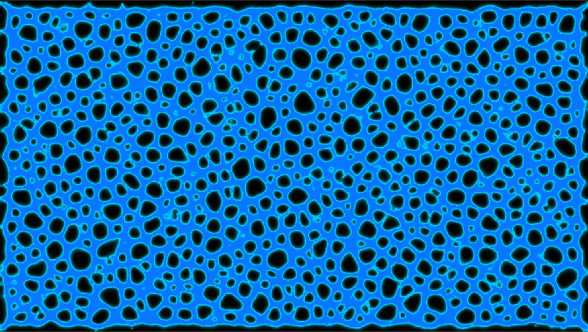
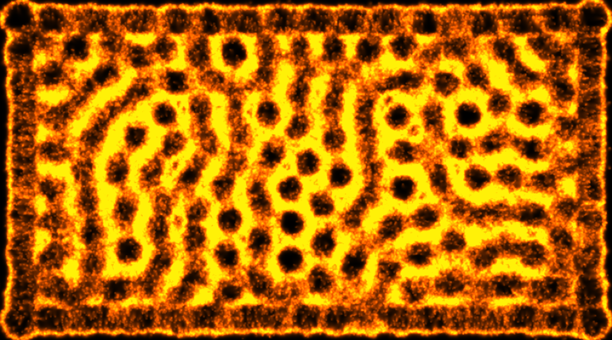
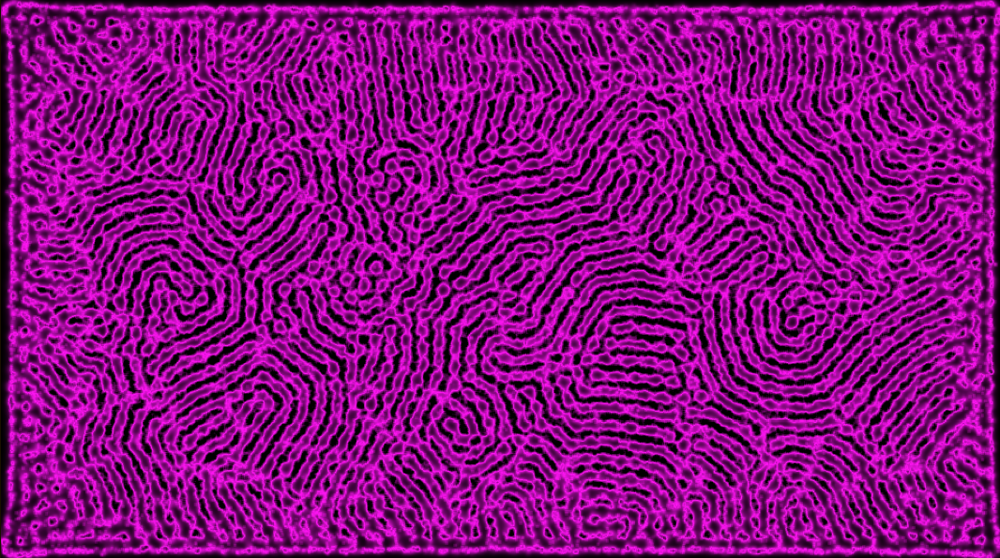
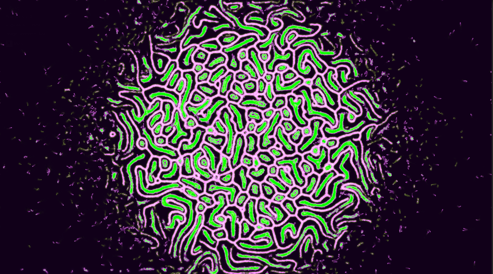
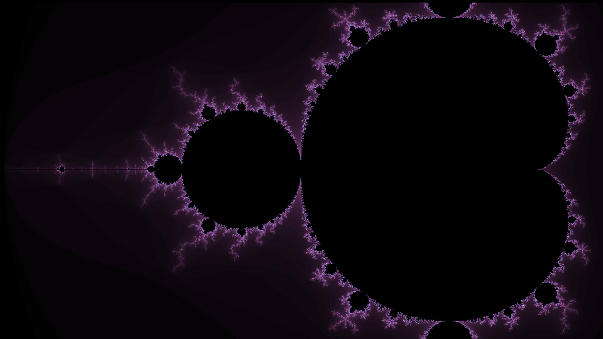

# CellEngine
Unity open-source project that simulates cellular life. All started with Conway's Game of Life, but furthermore i extended it with transport networks simulation inspired from
**Characteristics of Pattern Formation and Evolution in Approximations of __Physarum__ Transport Networks** by Jeff Jones. It uses compute shaders to have a relative high 
scale lattice environment, as well in JuliaSet fractals rendering in the background; so basically the app requires a high performance device with **dedicated GPU**. 

[Download](https://kbradu.itch.io/cellengine) 

