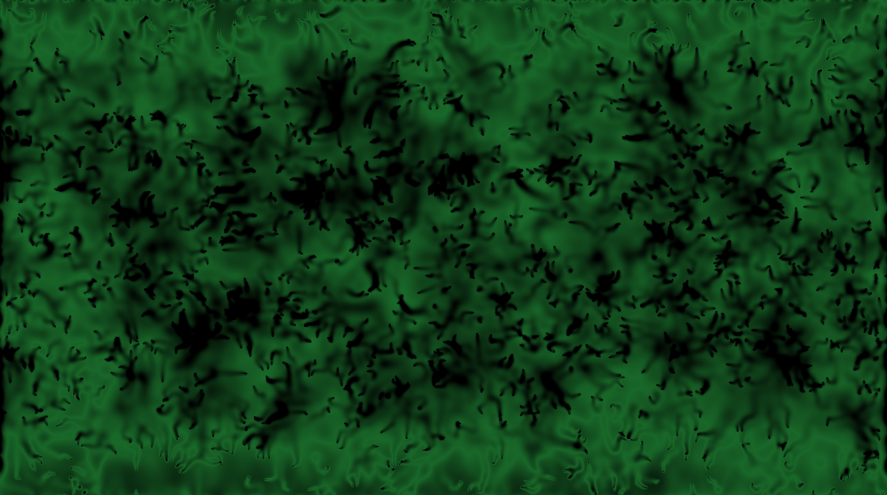

# Cellular-Automata-Visualizer
Unity open-source project that simulates cellular life. In was inspired by Conway's Game of Life, but furthermore i added transport networks simulation inspired from
**Characteristics of Pattern Formation and Evolution in Approximations of __Physarum__ Transport Networks" by Jeff Jones. It uses a compute shader for filtering with
a mean 3x3 kernel in order to have a relative high scale environment framework.

